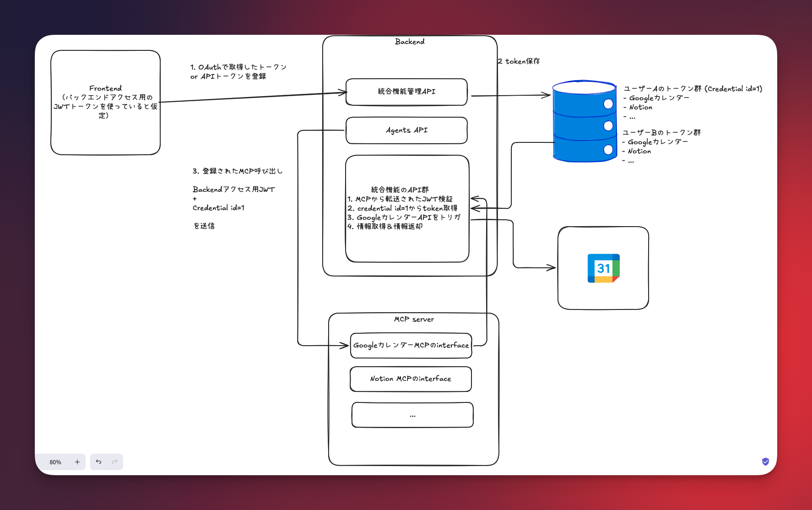

# MCP Example

## Architecture

## Tool Selection Control

- MCPサーバーは複数ツールを持つが、**実際にLLMへ渡すツールはルーム設定で限定**される。
- ユーザー（またはエージェント）が「使いたい統合だけ」を選べる設計なので、冗長な全ツール渡しは行わない。
- 将来ワークフロー拡張する場合も、**同一MCP内のツール群から必要なものだけ選択**できる。
