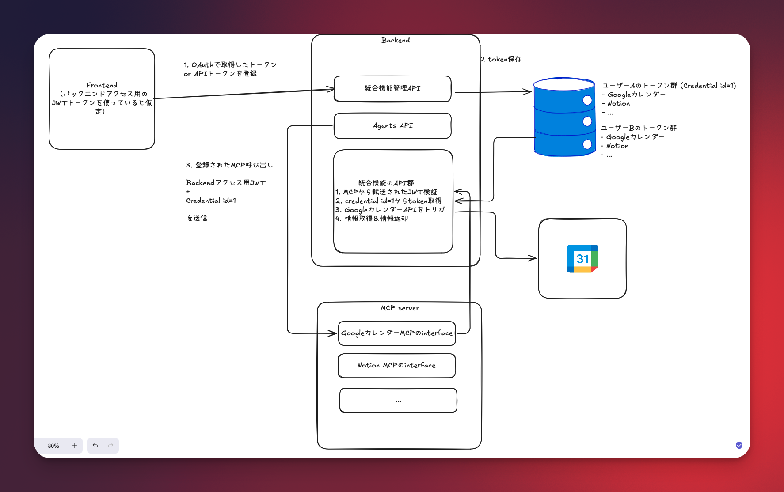

# MCP Example

## Architecture



## Local OAuth Test With Python Client

For local verification, use a Python MCP client against plain localhost. This is much simpler than testing from Claude Desktop because it does not require HTTPS termination.

This verifies:

- protected resource metadata on `mcp_server`
- OAuth metadata on `app_server`
- dynamic client registration
- authorization code flow
- refresh token flow
- authenticated MCP tool calls

### Prerequisites

- `app_server` and `mcp_server` running locally
- Google admin login configured
- at least one connected Google Calendar credential in the admin UI

### Start servers

1. In one terminal:
```bash
cd app_server
uv run main.py
```
2. In another terminal:
```bash
cd mcp_server
uv run main.py
```

### Local URLs

- App Server: `http://127.0.0.1:8000`
- MCP Server: `http://127.0.0.1:9001/mcp`

### Required local settings

- `app_server/.env`
  - `MCP_SERVER_URL=http://127.0.0.1:9001/mcp`
- `mcp_server/.env`
  - `APP_SERVER_URL=http://127.0.0.1:8000`
  - `AUTH_SERVER_URL=http://127.0.0.1:8000`
  - `MCP_PUBLIC_URL=http://127.0.0.1:9001`
  - `JWT_SECRET` and `JWT_ISSUER` must match `app_server/.env`

### Google OAuth redirect URIs for localhost

- `http://127.0.0.1:8000/auth/google/callback`
- `http://127.0.0.1:8000/oauth/google_calendar/callback`

### Recommended pre-checks

1. Open `http://127.0.0.1:8000/auth/login` and confirm Google login works.
2. Open `http://127.0.0.1:8000/credentials` and confirm the target Google Calendar credential is `connected`.
3. Open `http://127.0.0.1:8000/.well-known/oauth-authorization-server` and confirm metadata is returned.
4. Open `http://127.0.0.1:9001/.well-known/oauth-protected-resource/mcp` and confirm protected resource metadata is returned.

### Python client example

Run the included test client:

```bash
cd mcp_server
uv run test_oauth_client.py
```

Or use this minimal example:

```python
from fastmcp import Client
import anyio


async def main():
    async with Client("http://127.0.0.1:9001/mcp", auth="oauth") as client:
        tools = await client.list_tools()
        print(tools)


anyio.run(main)
```

Expected behavior:

1. The client discovers the MCP protected resource metadata from `mcp_server`.
2. The client discovers the authorization server metadata from `app_server`.
3. The client dynamically registers itself.
4. A browser opens for Google admin login and authorization.
5. The client receives tokens and retries the MCP request with bearer auth.
6. `tools/list` and tool calls succeed.

### Why this path is preferred for local testing

- no HTTPS setup required
- no local CA trust issues
- no Claude Desktop UI/debugging friction
- you can verify the full OAuth and dynamic registration flow directly

### What this does and does not prove

This localhost Python flow is a strong validation of the server-side implementation. It verifies:

- protected resource metadata on `mcp_server`
- authorization server metadata on `app_server`
- dynamic registration
- authorization code flow
- refresh token flow
- authenticated MCP requests

It does not fully guarantee Claude Desktop compatibility after deployment. HTTPS, public reachability, redirect URI configuration, and Claude Desktop-specific behavior still need to be verified in a real remote environment.

### Note about Claude Desktop

Claude Desktop remote MCP testing is still useful, but it typically expects HTTPS endpoints. Use it after the localhost Python flow is working.

## Tool Selection Control

- MCPサーバーは複数ツールを持つが、**実際にLLMへ渡すツールはルーム設定で限定**される。
- ユーザー（またはエージェント）が「使いたい統合だけ」を選べる設計なので、冗長な全ツール渡しは行わない。
- 将来ワークフロー拡張する場合も、**同一MCP内のツール群から必要なものだけ選択**できる。
